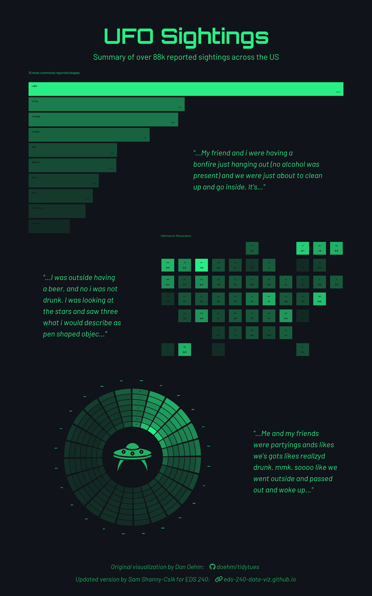

# EDS 240 - Assignment #1 (Interpreting `{ggplot2}` code)

This repository contains the details of the Assignment 1 for the course EDS 240 - Data Visualization & Communication for the Master of Environmental Data Science (MEDS) program.

## Background
As a data scientist, we will often work with code written by other people. This might include learning from existing code, modifying it for our projects, reviewing a teammate’s work, or checking the results produced by generative AI tools.

Being able to read, understand and explain code we didn't write is an essential skill. This repository focuses on practicing that skill. We will interpret **data wrangling** and **{ggplot2}** code written by someone else. To do this, we need to run the code (all at once or line by line), read documentation, search online and use AI tools to support our understanding.



## Objective
The main objective of this assignment is to interpret, explain and reflect on code adapted from Dan Oehm’s UFO Sightings visualization. Using the question prompts in `HW1.qmd`, this assignment focuses on understanding how the code works and why specific choices were made.

## Repository Structure
```
eds240-hw1-ufo
└─── .gitignore
└─── README.md
└─── eds240-hw1-ufo.Rproj
└─── fonts
      └─── Font Awesome 6 Brands-Regular-400.otf
      └─── Font Awesome 6 Free-Regular-400.otf
      └─── Font Awesome 6 Free-Solid-900.otf
└─── HW1_files
└─── HW1.html
└─── HW1.qmd
└─── images
      └─── ufo.png
└─── outputs
      └─── ufo_sightings_infographic.png
     
```

## Data
The dataset and metadata for this project come from the [rfordatascience/tidytuesday (2023-06-20)](https://github.com/rfordatascience/tidytuesday/blob/main/data/2023/2023-06-20/readme.md#data-dictionary) repository. We can find more details and documentation in [README.md](https://github.com/rfordatascience/tidytuesday/blob/main/data/2023/2023-06-20/readme.md#data-dictionary).

## References

### Course Information

- **Course Title:** [EDS 240 - Data Visualization & Communication](https://eds-240-data-viz.github.io/)
- **Term:** Winter 2026
- **Program:** [UCSB Masters in Environmental Data Science](https://bren.ucsb.edu/masters-programs/master-environmental-data-science).

Teaching Team:

- **Instructor:** [Sam Shanny-Csik](https://samanthacsik.github.io/)
- **Co-Instructor:** [Annie Adams](https://github.com/annieradams) 

Complete description for this assignment can be found on [Assignment 1](https://eds-240-data-viz.github.io/course-materials/assignments/HW1.html).
